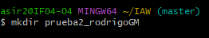
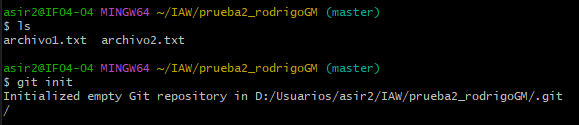
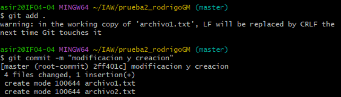
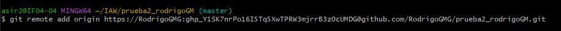
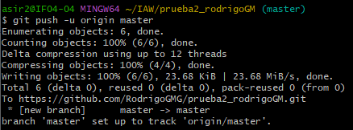
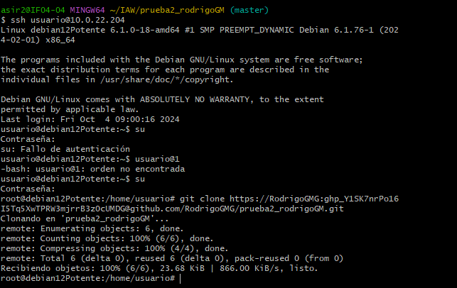
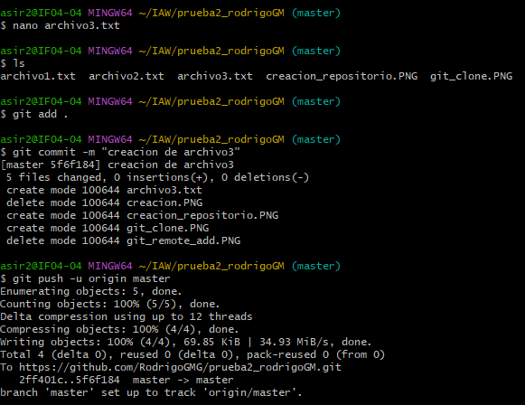
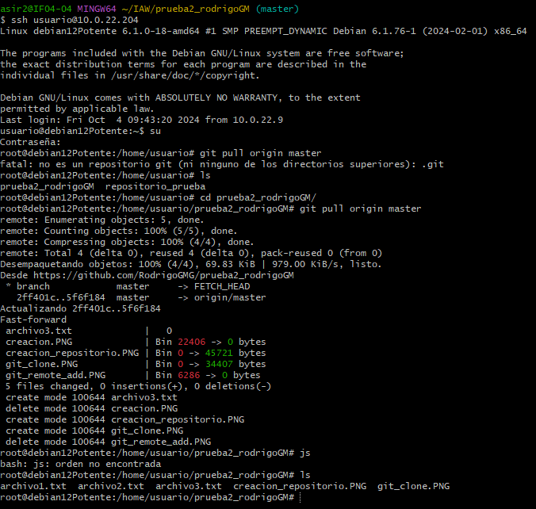

# Ejercicio 1

### 1. En esta captura te muestro como creo el repositorio y  como creo y subo los dos primeros ficheros que contiene, el archivo 3 ha sido creado posteriormente.

---
### 2. En esta captura te muestro como conecto el repositorio local con un repositorio remoto en GitHub.

---
### 3. En esta captura te muesto como subo el repositorio local a GitHub.

---
### 4. En esta captura te muestro como clono el repositorio en mi maquina virtual de Linux Debian.

---
### 5. En esta captura te muestro como añado un tercer archivo llamado "archivo3.txt" confirmando los cambios y posteriormente lo subo al repositorio usando git push.

---
### 6. En esta captura te muestro como actuializo la version local del repositorio en Linux Debian.

---